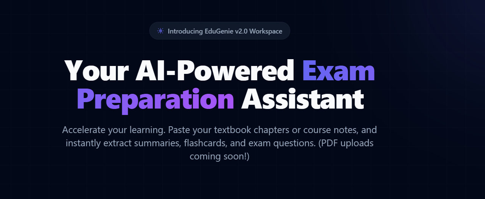
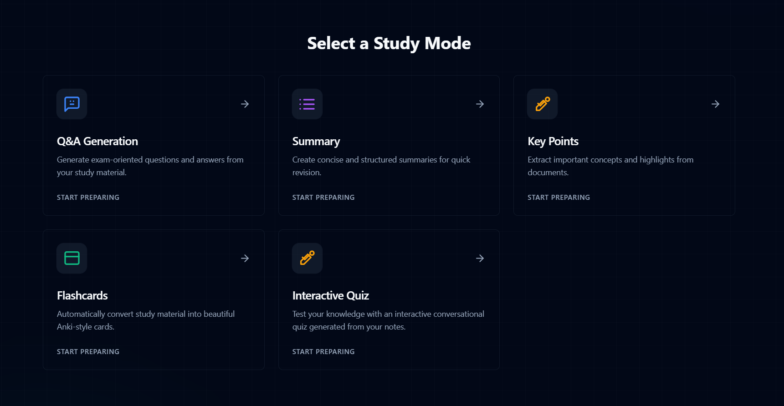

<div align="center">
  <!-- TODO: Replace this placeholder with a screenshot of your live application -->
  
</div>
<h1 align="center">EduGenie 2.0</h1>

<p align="center">
  <strong>Your AI-Powered Exam Preparation Assistant</strong><br>
  Transform your lecture notes into interactive flashcards, summaries, quizzes, and Q&A sets instantly.
</p>

<div align="center">
  <a href="#features">Features</a> •
  <a href="#tech-stack">Tech Stack</a> •
  <a href="#requirements--installation">Installation</a> •
  <a href="#database-setup">Database Setup</a>
</div>

<br>

<div align="center">
  <!-- TODO: Replace this placeholder with a screenshot of your chat interface -->
  
</div>
## ✨ Features

- 🧠 **Interactive Flashcards**: Automatically generate beautiful Anki-style cards from your text.
- 📝 **Summary Creator**: Condense long textbook chapters into bite-sized, readable bullet points.
- 🎯 **Q&A Generation**: Extract potential exam questions and answers from your study materials.
- 🎮 **Interactive Quizzes**: Test your knowledge dynamically with AI-generated quizzes.
- 🔐 **Secure User Authentication**: Powered by Supabase, keep your data and history private.
- 💾 **Cross-Device Sync**: Your search history is securely synced to the cloud and available everywhere.
- 🎨 **Beautiful UI/UX**: Built with Shadcn UI and Tailwind CSS for a premium, responsive dark mode experience.

## 🛠 Tech Stack

- **Frontend Framework**: [React](https://react.dev/) + [Vite](https://vitejs.dev/)
- **Styling**: [Tailwind CSS](https://tailwindcss.com/) + [Shadcn UI](https://ui.shadcn.com/)
- **Authentication & Database**: [Supabase](https://supabase.com/) (PostgreSQL)
- **AI Backend / Orchestration**: [n8n](https://n8n.io/) workflows running on an **AWS EC2 Ubuntu Instance**.
- **Routing**: React Router DOM

## 📋 Requirements & Installation

Before running the project locally, ensure you have the following installed:
- [Node.js](https://nodejs.org/en/) (v18 or higher)
- [npm](https://www.npmjs.com/) or [yarn](https://yarnpkg.com/)

### 1. Clone the repository
```bash
git clone https://github.com/Shankar7868/EduGenie.git
cd EduGenie
```

### 2. Install Dependencies
```bash
npm install
```

### 3. Environment Variables
Create a `.env` file in the root directory and add your keys:
```env
VITE_WEBHOOK_URL=your_n8n_webhook_url
VITE_SUPABASE_URL=your_supabase_project_url
VITE_SUPABASE_ANON_KEY=your_supabase_anon_key
```

### 4. Start the Development Server
```bash
npm run dev
```
Open [http://localhost:5173](http://localhost:5173) in your browser to see the app running!

## ☁️ Database Setup

To enable search history syncing, run the following SQL command in your Supabase SQL Editor:

```sql
create table search_history (
  id uuid default gen_random_uuid() primary key,
  user_id uuid references auth.users not null,
  query text not null,
  created_at timestamp with time zone default timezone('utc'::text, now()) not null
);

alter table search_history enable row level security;

create policy "Users can insert their own searches"
  on search_history for insert with check (auth.uid() = user_id);

create policy "Users can view their own searches"
  on search_history for select using (auth.uid() = user_id);

create policy "Users can delete their own searches"
  on search_history for delete using (auth.uid() = user_id);
```

## ☁️ AWS & Backend Setup (n8n)

The AI orchestration for EduGenie is completely decoupled from the frontend, running on an independent AWS EC2 instance. This architecture ensures scalable prompt handling and API queue management.

### Steps to replicate the backend:
1. **Provision an EC2 Instance**: Launch an Ubuntu instance on AWS (e.g., `18.60.42.250`).
2. **Install Docker**: Connect to your instance via SSH and install Docker and Docker Compose.
3. **Run n8n**: Use a `docker-compose.yml` to spin up n8n and an optional PostgreSQL database for workflow storage.
   ```bash
   docker compose up -d
   ```
4. **Configure the AI Workflow**: 
   - Import your workflow into n8n.
   - The workflow uses a Webhook node to listen for requests from the React frontend.
   - It is configured with multiple Gemini/OpenAI API keys in a fallback queue to ensure high availability and bypass free-tier rate limits.
5. **Set up the Webhook Tunnel & Vercel Proxy**: 
   - To bypass CORS issues when calling the n8n webhook directly from the frontend, we use Vercel's rewrite functionality.
   - Create a `vercel.json` file in your root directory to proxy `/api/webhook` requests directly to your AWS IP:
     ```json
     {
       "rewrites": [
         { "source": "/api/webhook/:path*", "destination": "http://18.60.42.250:5678/webhook/:path*" }
       ]
     }
     ```
   - In your `.env` file, simply set `VITE_WEBHOOK_URL=/api/webhook/[YOUR_N8N_WEBHOOK_ID]`.

> **Note**: Update `[YOUR_N8N_WEBHOOK_ID]` and the IP address `18.60.42.250` with your own values if you are cloning this repository.

## 📄 License
This project is licensed under the MIT License.
